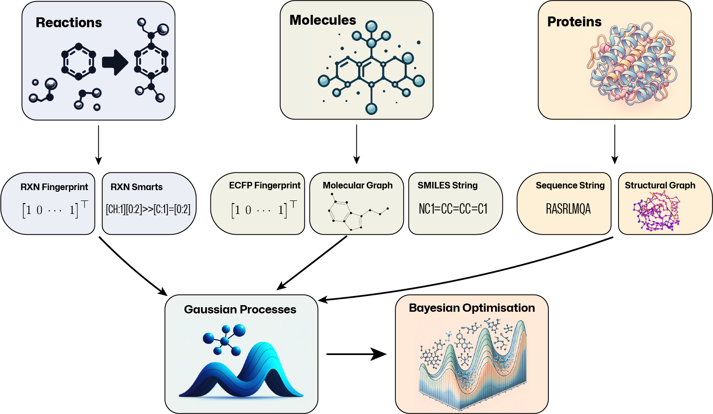

.. GAUCHE documentation master file, created by
   sphinx-quickstart on Tue May 24 16:43:52 2022.
   You can adapt this file completely to your liking, but it should at least
   contain the root `toctree` directive.

Documentation
==================

.. image:: ../../imgs/gauche_banner_1.png
    :width: 100%
    :alt: GAUCHE Logo
    :align: left

**GAUCHE** is a collaborative, open-source software library that aims to make state-of-the-art probabilistic modelling and black-box optimisation techniques more easily accessible to scientific experts in chemistry, materials science and beyond. We provide 30+ bespoke kernels for molecules, chemical reactions and proteins and illustrate how they can be used for Gaussian processes and Bayesian optimisation in 10+ easy-to-adapt tutorial notebooks.

`Paper (NeurIPS 2023) <https://arxiv.org/abs/2212.04450>`_

Overview
==========

General-purpose Gaussian process (GP) and Bayesian optimisation (BO) libraries do not cater for molecular representations. Likewise, general-purpose molecular machine learning libraries do not consider GPs and BO. To bridge this gap, GAUCHE provides a modular, robust and easy-to-use framework of 30+ parallelisable and batch-GP-compatible implementations of string, fingerprint and graph kernels that operate on a range of widely-used molecular representations.

Kernels
---------

Standard GP packages typically assume continuous input spaces of low and fixed dimensionality. This makes it difficult to apply them to common molecular representations: molecular graphs are discrete objects, SMILES strings vary in length and topological fingerprints tend to be high-dimensional and sparse. To bridge this gap, GAUCHE provides:

* **Fingerprint Kernels** that measure the similarity between bit/count vectors of descriptor by examining the degree to which their elements overlap.
* **String Kernels** that measure the similarity between strings by examining the degree to which their sub-strings overlap.
* **Graph Kernels** that measure between graphs by examining the degree to which certain substructural motifs overlap.

Representations
-----------------

GAUCHE supports any representation that is based on bit/count vectors, strings or graphs. For rapid prototyping and benchmarking, we also provide a range of standard featurisation techniques for molecules, chemical reactions and proteins:

.. list-table::
   :header-rows: 1

   * - Domain
     - Representation
   * - Molecules
     - ECFP Fingerprints [1], rdkit Fragments, Fragprints, Graphs [2], SMILES [3], SELFIES [4]   
   * - Chemical Reactions
     - One-Hot Encoding, Data-Driven Reaction Fingerprints [5], Differential Reaction Fingerprints [6], Reaction SMARTS
   * - Proteins  
     - Sequences, Graphs [2]

Getting Started
-----------------

The easiest way to install Gauche is via pip. 

`pip install gauche`

As not all users will need the full functionality of the package, we provide a range of installation options: 

* `pip install gauche` - installs the core functionality of GAUCHE (kernels, representations, data loaders, etc.) and should cover a wide range of use cases.
* `pip install gauche[rxn]` - additionally installs the rxnfp and drfp fingerprints that can be used to represent chemical reactions.
* `pip install gauche[graphs]` - installs all dependencies for graph kernels and representations.

If you aren't sure which installation option is right for you, you can simply install all of them with `pip install gauche[all]`.

The best way to get started with GAUCHE is to check out our tutorial notebooks. These notebooks provide a step-by-step introduction to the core functionality of GAUCHE and illustrate how it can be used to solve a range of common problems in molecular property prediction and optimisation.

.. toctree::
   :maxdepth: 1
   
   notebooks/loading_and_featurising_molecules.nblink
   notebooks/gp_regression_on_molecules.nblink
   notebooks/bayesian_optimisation_over_molecules.nblink
   notebooks/sparse_gp_regression_for_big_molecular_data.nblink
   notebooks/multitask_gp_regression_on_molecules.nblink
   notebooks/molecular_preference_learning.nblink
   notebooks/preferential_bayesian_optimisation.nblink
   notebooks/protein_fitness_prediction_bag_of_amino_acids.nblink
   notebooks/protein_fitness_prediction_ssk_gp.nblink

Extensions
-----------------

If there are any specific kernels or representations that you would like to see included in GAUCHE, please reach out or submit an issue/pull request.

Gauche's API
================

.. toctree::
   :maxdepth: 3
   :caption: API Reference

   modules/kernels
   modules/representations
   modules/dataloader

Indices and tables
==================

* :ref:`genindex`
* :ref:`modindex`
* :ref:`search`

References
==================

.. _bibliography:

[1] Rogers, D. and Hahn, M., 2010. `Extended-connectivity fingerprints. <https://pubs.acs.org/doi/abs/10.1021/ci100050t>`_ Journal of Chemical Information and Modeling, 50(5), pp.742-754.

[2] Jamasb, A., Viñas Torné, R., Ma, E., Du, Y., Harris, C., Huang, K., Hall, D., Lió, P. and Blundell, T., 2022. `Graphein-a Python library for geometric deep learning and network analysis on biomolecular structures and interaction networks <https://proceedings.neurips.cc/paper_files/paper/2022/hash/ade039c1db0391106a3375bd2feb310a-Abstract-Conference.html>`_. Advances in Neural Information Processing Systems, 35, pp.27153-27167.

[3] Weininger, D., 1988. `SMILES, a chemical language and information system. 1. Introduction to methodology and encoding rules. <https://pubs.acs.org/doi/pdf/10.1021/ci00057a005>`_ Journal of Chemical Information and Computer Sciences, 28(1), pp.31-36.

[4] Krenn, M., Häse, F., Nigam, A., Friederich, P. and Aspuru-Guzik, A., 2020. `Self-referencing embedded strings (SELFIES): A 100% robust molecular string representation <https://iopscience.iop.org/article/10.1088/2632-2153/aba947/meta>`_. Machine Learning: Science and Technology, 1(4), p.045024.

[5] Probst, D., Schwaller, P. and Reymond, J.L., 2022. `Reaction classification and yield prediction using the differential reaction fingerprint DRFP <https://pubs.rsc.org/en/content/articlehtml/2022/dd/d1dd00006c>`_. Digital Discovery, 1(2), pp.91-97.

[6] Schwaller, P., Probst, D., Vaucher, A.C., Nair, V.H., Kreutter, D., Laino, T. and Reymond, J.L., 2021. `Mapping the space of chemical reactions using attention-based neural networks <https://www.nature.com/articles/s42256-020-00284-w>`_. Nature Machine Intelligence, 3(2), pp.144-152.